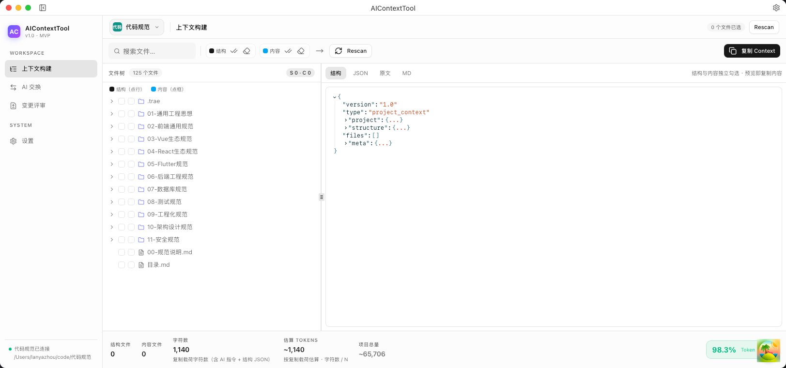
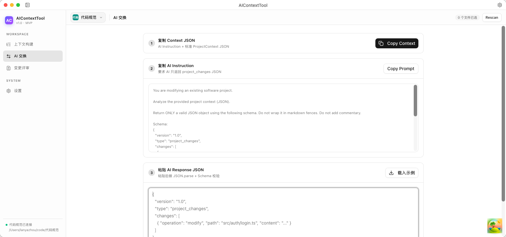
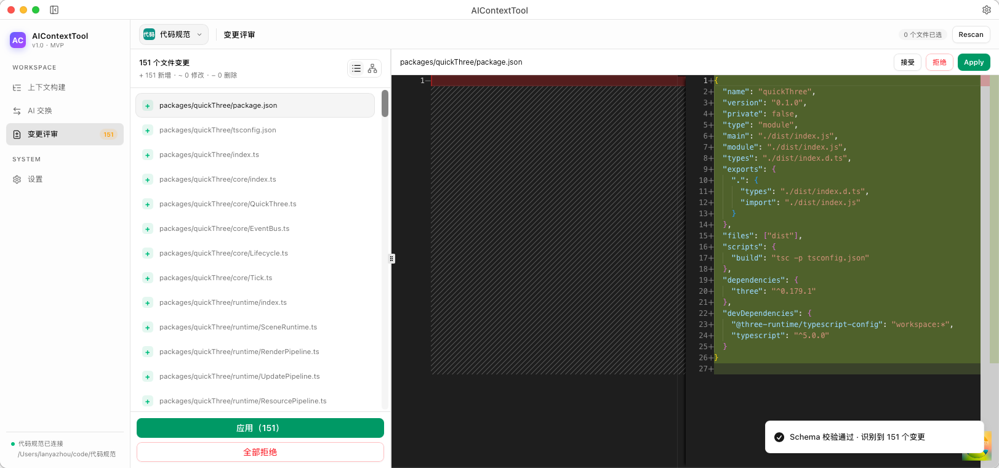
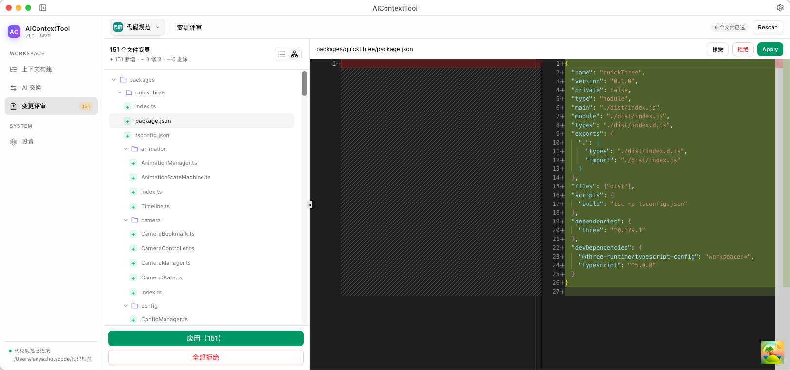

# AIContextTool

把**本地项目上下文**安全地交给网页 AI，并把 AI 返回的**结构化修改**应用回本地。

面向使用 ChatGPT / DeepSeek / Gemini 等免费网页 AI 的开发者：不必购买 AI Coding Agent，也能完成「选文件 → 复制 Context → AI 修改 → 解析 → Diff → Apply → Undo」闭环。

---

## 产品是什么

| 维度     | 说明                                                  |
| -------- | ----------------------------------------------------- |
| 形态     | 跨平台独立桌面应用（Tauri 2）                         |
| 核心价值 | 减少 Token 浪费；解决网页 AI 与本地项目之间的代码传递 |
| 不做什么 | 不做 AI Coding Agent、不做 IDE、不绑定某一家 AI       |

### 典型流程

```text
打开本地项目
    ↓
文件树勾选「结构」+「内容」（两个维度独立）
    ↓
生成标准 ProjectContext JSON（可预览 Tree / JSON / Raw / MD）
    ↓
复制（AI Instruction + Context JSON）→ 粘贴到网页 AI
    ↓
AI 返回 project_changes JSON
    ↓
粘贴回软件 → Schema 校验 → ChangeSet
    ↓
Monaco Diff 评审 → Apply
    ↓
.history 快照 → 可 Undo
```

---

## 主要功能

### 项目与文件树

- 原生目录选择、最近项目、一键 Rescan
- 默认忽略：`.git/`、`node_modules/`、`dist/`、`.env`、`*.key` / `*.pem` 等敏感文件
- 支持项目根目录 `.aiignore`
- **结构选择**与**内容选择**独立：例如只带 `src/auth/` 目录树 + 单个 `Login.tsx` 全文

### Context Builder

- 生成协议标准 `ProjectContext` JSON
- 预览：**结构 Tree** / **JSON** / **Raw** / **MD**
- Token 按**实际复制载荷**估算（含 AI 指令 + 结构 JSON）
- 设置页可配置「每 Token 字符数」（默认 4）
- MD 预览可单独复制（`## 结构` + `## 文件`）

### AI Exchange

- 一键复制：AI Instruction + ProjectContext JSON
- 粘贴 AI 回复（JSON）→ `JSON.parse` + Schema / 路径安全校验
- 支持从系统剪贴板粘贴按钮

### Change Review

- 变更列表：**列表 / 树结构** 两种视图
- Monaco **DiffEditor** 左右对比 Current vs AI Changes
- 状态：`pending` / `accepted` / `rejected` / `applied` / `failed`
- 单文件 Apply / Apply All / Reject All / Undo
- 外部修改冲突检测（Context 创建时的 hash 对比），可覆盖或取消
- ADD 自动创建缺失的多级父目录

### 工作台

- 左导航：上下文构建 / AI 交换 / 变更评审 / 设置
- 顶栏：项目切换器、页标题、选中数、Rescan
- TitleBar 左侧收起/展开侧栏（图标模式），右侧设置
- 界面语言：**中文（默认）/ English**

---

## JSON 交换协议

UI 不自行拼接格式；复制与解析统一走 `src/lib/protocol`。

### 复制给 AI 的内容

```text
<AI Instruction>

---

{
  "version": "1.0",
  "type": "project_context",
  "project": { "name": "my-app" },
  "structure": { ... },
  "files": [{ "path": "...", "content": "...", "hash": "..." }],
  "meta": { ... }
}
```

### AI 应返回

```json
{
  "version": "1.0",
  "type": "project_changes",
  "changes": [
    {
      "operation": "add | modify | delete",
      "path": "relative/path/to/file.ts",
      "content": "完整文件内容（add/modify 必填）"
    }
  ]
}
```

校验项：`version`、`type`、字段类型、路径安全（禁止 `..` / 绝对路径；允许中文与空格文件名）。

---

## 技术栈

| 层          | 技术                                                   |
| ----------- | ------------------------------------------------------ |
| 桌面        | Tauri 2                                                |
| 前端        | React 19 + TypeScript + Vite                           |
| UI          | Tailwind CSS v4 + shadcn/ui + Lucide                   |
| Diff / 编辑 | `@monaco-editor/react`（DiffEditor）                   |
| JSON 预览   | `@uiw/react-json-view`                                 |
| 状态        | Zustand（ui / project / context / changes / settings） |
| IPC         | tauri-specta 类型安全命令                              |
| 后端        | Rust：扫描、Context、Apply、`.history` 快照            |
| 测试        | Vitest + cargo test                                    |
| 质量        | ESLint / Prettier / ast-grep / clippy                  |

> 文件扫描与哈希当前使用 std 实现（FNV-1a 指纹 + 递归目录），可平滑替换为 `walkdir` / `ignore` / `sha2`。

---

## 快速开始

### 环境

- Node.js ≥ 20
- Rust（stable）
- 平台依赖见 [Tauri 官方文档](https://v2.tauri.app/start/prerequisites/)

### 开发

```bash
npm install
npm run tauri:dev
```

### 构建

```bash
npm run tauri:build
```

### 质量门禁

```bash
npm run check:all
```

覆盖：typecheck、ESLint、ast-grep、Prettier、cargo fmt/clippy、Vitest、cargo test。

常用脚本：

| 命令                    | 说明                          |
| ----------------------- | ----------------------------- |
| `npm run test:run`      | 前端测试                      |
| `npm run rust:test`     | Rust 测试                     |
| `npm run rust:bindings` | 重新导出 tauri-specta TS 绑定 |

---

## 目录结构（摘要）

```text
src/
├── app/                    # 应用组装：App、providers
├── features/               # 产品功能
│   ├── project/            # 打开/扫描/最近项目
│   ├── context/            # 文件树、双维选择、预览、Token
│   ├── changes/            # AI 交换、解析、Diff、Apply
│   ├── workspace/          # 导航壳、设置页
│   ├── command-palette/
│   ├── preferences/
│   └── quick-pane/
├── components/
│   ├── code/               # MonacoDiff、JsonTreeView、CodeViewer
│   ├── layout/ titlebar/ ui/
├── lib/
│   ├── protocol/           # JSON 协议：Schema / Token / Markdown
│   ├── tauri/              # specta bindings + 桥接
│   └── commands/           # 应用命令系统（快捷键/面板）
├── services/               # Tauri IPC 封装
├── store/                  # ui-store、app-settings
└── i18n/ + locales/        # 中文默认、English

src-tauri/src/
├── commands/               # open_project、build_context、apply…
├── services/               # scanner、context_builder、apply_engine
├── platform/ types/
└── bindings.rs             # tauri-specta 导出
```

---

## 安全设计

- 所有读写限制在**项目根目录**内，禁止 `..` 与绝对路径
- ADD 新路径：校验已存在祖先仍在根内，并自动 `create_dir_all`
- 敏感文件默认不进 Context，也不允许被 AI 修改
- Apply 前强制走 Parse → Diff → 确认；可选外部修改冲突检测
- Undo 快照写在项目内 `.history/<timestamp>_<id>/`（含 `manifest.json`）

---

## 效果截图(mac)








## 非目标 / 后续

**MVP 不做：** AI API 直连、内置聊天、IDE 能力、云同步。

**可扩展：** `.aiignore` 自定义规则 UI、相关文件推荐、MOVE/RENAME、Change History、多 Export 格式。

---

## 许可

MIT（见 `LICENSE.md`）。

基于 [dannysmith/tauri-template](https://github.com/dannysmith) 思路重构为本产品工作台。
